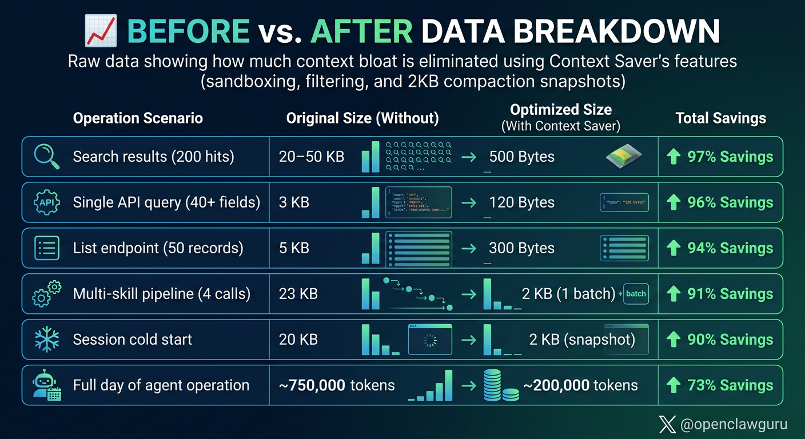

# OpenClaw Context Saver

**The first tool built specifically to solve the AI agent context window waste problem. Cut your agent's token usage by 70-98%. Zero dependencies. Drop-in install.**

No other tool does this. Every AI agent framework — AutoGPT, CrewAI, LangChain, OpenAI Assistants — dumps full API responses into the context window and burns through tokens. Nobody built a solution. So we did.

Your agent calls an API skill and gets back 3-50 KB of raw JSON. It needed 120 bytes. The rest? Wasted tokens burning through your context window. Every single call. Every single day. That's thousands of dollars in unnecessary API costs for production agent systems.

Context Saver is **the first purpose-built context optimization layer for AI agents**. It fixes this with three mechanisms: **sandboxed execution**, **intent-driven filtering**, and **session continuity** — all in pure Python with no external dependencies.

> **Why does this matter?** Because context windows are the #1 bottleneck for autonomous AI agents. Models get slower, dumber, and more expensive as context fills up. Every framework talks about RAG and embeddings for *retrieval* — but nobody optimized what goes *into* the context in the first place. Until now.

---

## Before & After

```
WITHOUT Context Saver:
  agent calls skill → 3 KB raw JSON floods context → 40 wasted fields
  agent calls skill → 5 KB raw JSON floods context → 50 irrelevant records
  agent calls skill → 20 KB raw JSON floods context → 200 search results
  Session compacts → all working state lost → 20 KB cold restart

  Daily token burn: ~750,000 tokens

WITH Context Saver:
  agent calls ctx_run → 120 B summary enters context → full data indexed for later
  agent calls ctx_run → 300 B filtered enters context → only matching records
  agent calls ctx_batch → 500 B combined enters context → one call, not three
  Session compacts → 2 KB snapshot preserved → instant resume

  Daily token burn: ~200,000 tokens (73% reduction)
```

---

## Installation

### Option 1: Clone into your OpenClaw skills directory

```bash
git clone https://github.com/tlancas25/openclaw-context-saver.git
cp -r openclaw-context-saver ~/.openclaw/workspace/skills/context-saver
```

### Option 2: Clone and symlink

```bash
git clone https://github.com/tlancas25/openclaw-context-saver.git ~/openclaw-context-saver
ln -s ~/openclaw-context-saver ~/.openclaw/workspace/skills/context-saver
```

### Verify installation

```bash
python3 ~/.openclaw/workspace/skills/context-saver/scripts/ctx_stats.py
```

You should see a JSON response with `"success": true`. That's it — no pip install, no node_modules, no build step.

### Requirements

- **Python 3.8+** (standard library only — no pip dependencies)
- **SQLite** (bundled with Python)
- **OpenClaw** instance with a `workspace/skills/` directory

### Environment Variables

| Variable | Default | Description |
|----------|---------|-------------|
| `OPENCLAW_HOME` | `~/.openclaw` | Root directory for your OpenClaw instance |
| `CTX_SNAPSHOT_BUDGET` | `2048` | Max bytes for session snapshots (adjustable) |
| `CTX_FTS_ENABLED` | `1` | Set to `0` to disable FTS5 indexing |

If your OpenClaw home directory is somewhere other than `~/.openclaw`, set it:

```bash
export OPENCLAW_HOME=/path/to/your/openclaw
```

---

## How It Works

Context Saver has three layers that work together:

### Layer 1: Sandboxed Execution

Skill commands run in **isolated subprocesses**. The full output is captured but never returned to the context window. Instead, a compact summary (100-500 bytes) is sent back while the full output gets indexed in SQLite FTS5 for on-demand retrieval.

```bash
# Without Context Saver: raw 3 KB JSON enters context
python3 skills/my-api/scripts/cli.py dashboard

# With Context Saver: 120 B summary enters context, full output indexed
python3 skills/context-saver/scripts/ctx_run.py --skill my-api --cmd "dashboard"
```

### Layer 2: Intent-Driven Filtering

Pass an `--intent` string and Context Saver extracts only the fields that match your question. Uses fast keyword scoring against JSON keys and values — no ML, no embeddings, no latency.

```bash
# Returns only fields related to errors (3 fields instead of 40+)
python3 scripts/ctx_run.py --skill my-api --cmd "dashboard" --intent "check error rate"

# Returns only items with failing status
python3 scripts/ctx_run.py --skill my-api --cmd "list-services" --intent "find failures"

# Or use explicit field selection for precision
python3 scripts/ctx_run.py --skill my-api --cmd "dashboard" --fields "active_users,error_rate,uptime"
```

### Layer 3: Session Continuity

Critical events are logged to SQLite with priority levels (P1-P4). Before conversation compaction wipes your context, a **2 KB snapshot** captures everything that matters. On resume, the snapshot restores full operational context without re-fetching anything.

```bash
# Log events as they happen
python3 scripts/ctx_session.py log --type "deploy" --priority critical \
  --data '{"service":"api-v2","version":"2.1.0"}'

# Before compaction: save state
python3 scripts/ctx_session.py snapshot

# After compaction: restore state
python3 scripts/ctx_session.py restore
```

---

## Usage

### Single Command (Sandboxed)

```bash
# Basic — auto-summarize any skill output
python3 scripts/ctx_run.py --skill my-api --cmd "status"

# With intent — only return relevant fields
python3 scripts/ctx_run.py --skill my-api --cmd "list-items" --intent "find failing items"

# With field selection — explicit control
python3 scripts/ctx_run.py --skill my-api --cmd "dashboard" --fields "users,errors,latency"

# Raw mode — get full output (bypasses filtering)
python3 scripts/ctx_run.py --skill my-api --cmd "dashboard" --raw
```

**Output format:**

```json
{
  "success": true,
  "skill": "my-api",
  "command": "dashboard",
  "summary": {"active_users": 12543, "error_rate": 0.02, "uptime": "99.98%"},
  "raw_bytes": 3072,
  "summary_bytes": 85,
  "bytes_saved": 2987,
  "savings_pct": 97.2
}
```

### Batch Execution (Multiple Skills, One Call)

Replace 4 separate skill calls (23 KB, 4 context insertions) with 1 batch call (2 KB, 1 insertion):

```bash
python3 scripts/ctx_batch.py --commands '[
  {"skill": "my-api", "cmd": "dashboard", "fields": ["active_users", "error_rate"]},
  {"skill": "analytics-engine", "cmd": "metrics", "intent": "summary"},
  {"skill": "health-monitor", "cmd": "check", "intent": "failures only"}
]'
```

**Output format:**

```json
{
  "success": true,
  "commands_run": 3,
  "commands_succeeded": 3,
  "commands_failed": 0,
  "total_raw_bytes": 15360,
  "total_summary_bytes": 1240,
  "total_bytes_saved": 14120,
  "total_savings_pct": 91.9,
  "results": [...]
}
```

You can also load from a pipeline file:

```bash
python3 scripts/ctx_batch.py --pipeline examples/daily-status-pipeline.json
```

### Search Indexed Data

Every `ctx_run` execution indexes the full output in SQLite FTS5. Query it later without re-running commands:

```bash
# Search all indexed outputs
python3 scripts/ctx_search.py "error rate spike"

# Scoped to a specific skill
python3 scripts/ctx_search.py "failed deployments" --source my-api

# Limit results
python3 scripts/ctx_search.py "timeout" --limit 5
```

Supports FTS5 query syntax: `"exact phrase"`, `term1 AND term2`, `prefix*`.

### Session Event Tracking

```bash
# Log events at different priority levels
python3 scripts/ctx_session.py log --type "deploy" --priority critical \
  --data '{"service":"api-v2","version":"2.1.0"}'

python3 scripts/ctx_session.py log --type "alert" --priority high \
  --data '{"service":"cache","msg":"memory at 92%"}'

python3 scripts/ctx_session.py log --type "analysis" --priority medium \
  --data '{"result":"stable","anomalies":0}'

# Snapshot before compaction
python3 scripts/ctx_session.py snapshot

# Restore after compaction
python3 scripts/ctx_session.py restore

# View session stats
python3 scripts/ctx_session.py stats
```

**Priority system:**

| Priority | Label | Snapshot Budget | Use For |
|----------|-------|-----------------|---------|
| `critical` | P1 | 40% of 2 KB | Actions that changed state, system errors |
| `high` | P2 | 30% of 2 KB | Alerts, config changes, threshold breaches |
| `medium` | P3 | 20% of 2 KB | Analysis results, routine checks |
| `low` | P4 | 10% of 2 KB | Info queries, status checks |

The snapshot builder allocates budget by priority, ensuring critical events are **always** preserved even when the 2 KB limit is tight.

### View Stats

```bash
python3 scripts/ctx_stats.py
```

Shows total bytes saved, number of runs, average compression ratio, top skills by savings, indexed documents count, and session event stats.

---

## Benchmarks



| Operation | Without | With Context Saver | Savings |
|-----------|---------|--------------------|---------|
| Single API query (40+ fields) | 3 KB | 120 B | **96%** |
| List endpoint (50 records) | 5 KB | 300 B | **94%** |
| Search results (200 hits) | 20-50 KB | 500 B | **97%** |
| Multi-skill pipeline (4 calls) | 23 KB | 2 KB (1 batch) | **91%** |
| Session cold start after compaction | 20 KB | 2 KB snapshot | **90%** |
| Full day of agent operation | ~750K tokens | ~200K tokens | **73%** |

See [docs/BENCHMARKS.md](docs/BENCHMARKS.md) for detailed methodology and scenario breakdowns.

---

## Architecture

```
┌─────────────────────────────────────────────────────┐
│                  Claude Context Window               │
│                                                     │
│   ┌──────────┐   ┌──────────┐   ┌──────────┐      │
│   │  120 B   │   │  300 B   │   │   2 KB   │      │
│   │ summary  │   │ filtered │   │ snapshot │      │
│   └────┬─────┘   └────┬─────┘   └────┬─────┘      │
│        │              │              │             │
└────────┼──────────────┼──────────────┼─────────────┘
         │              │              │
   ┌─────┴──────────────┴──────────────┴──────┐
   │           Context Saver Layer             │
   │                                           │
   │  ┌──────────┐ ┌──────────┐ ┌──────────┐  │
   │  │ Sandbox  │ │  Intent  │ │ Session  │  │
   │  │ Runner   │ │  Filter  │ │ Tracker  │  │
   │  └────┬─────┘ └────┬─────┘ └────┬─────┘  │
   │       │            │            │         │
   │  ┌────┴────────────┴────────────┴────┐    │
   │  │    SQLite FTS5 Index + Stats      │    │
   │  │    (~/.openclaw/context/*.db)     │    │
   │  └───────────────────────────────────┘    │
   └───────────────────────────────────────────┘
         │              │              │
   ┌─────┴─────┐  ┌─────┴─────┐  ┌────┴──────┐
   │   3 KB    │  │   5 KB    │  │  20-50 KB │
   │ raw JSON  │  │ raw JSON  │  │  raw JSON │
   └───────────┘  └───────────┘  └───────────┘
        Skill Subprocesses (never enter context)
```

See [docs/ARCHITECTURE.md](docs/ARCHITECTURE.md) for detailed data flow diagrams, SQLite schemas, and the snapshot budget allocation algorithm.

---

## Integrating with Your Skills

Context Saver works with **any** OpenClaw skill out of the box. It wraps the skill's CLI output and filters it automatically.

For even better results, add a `--summary` flag to your skill scripts so they can produce domain-aware compact output:

```python
# my_skill/scripts/cli.py
import argparse, json

def summarize(data, fields=None):
    if fields:
        return {k: v for k, v in data.items() if k in fields}
    return {k: v for k, v in data.items() if not isinstance(v, (dict, list))}

parser = argparse.ArgumentParser()
parser.add_argument("--summary", action="store_true")
parser.add_argument("--fields", help="Comma-separated fields")
args = parser.parse_args()

result = your_api_call()
if args.summary:
    result = summarize(result, args.fields.split(",") if args.fields else None)
print(json.dumps(result))
```

See [docs/INTEGRATION.md](docs/INTEGRATION.md) for pipeline integration, automated event logging, HEARTBEAT.md hooks, and workflow-engine compatibility.

---

## File Structure

```
openclaw-context-saver/
├── scripts/
│   ├── ctx_run.py        # Sandboxed skill execution + intent filtering
│   ├── ctx_batch.py      # Multi-skill batch execution
│   ├── ctx_session.py    # Session event tracking + snapshots
│   ├── ctx_search.py     # FTS5 search across indexed outputs
│   └── ctx_stats.py      # Usage statistics dashboard
├── docs/
│   ├── ARCHITECTURE.md   # Data flow, schemas, algorithms
│   ├── BENCHMARKS.md     # Detailed scenarios and methodology
│   └── INTEGRATION.md    # How to integrate with existing skills
├── examples/
│   ├── daily-status-pipeline.json    # Example batch pipeline
│   └── eod-report-pipeline.json      # Example EOD pipeline
├── SKILL.md              # OpenClaw skill manifest
├── skill.json            # Machine-readable skill definition
├── LICENSE               # MIT
└── README.md
```

---

## Configuration

All paths are derived from `OPENCLAW_HOME` (default: `~/.openclaw`):

| Path | Purpose |
|------|---------|
| `$OPENCLAW_HOME/workspace/skills/` | Where Context Saver looks for skills to execute |
| `$OPENCLAW_HOME/context/stats.db` | Execution statistics + FTS5 full-text index |
| `$OPENCLAW_HOME/context/sessions.db` | Session event log + compaction snapshots |
| `$OPENCLAW_HOME/.env` | Environment variables passed to skill subprocesses |

Both `.db` files are created automatically on first use. No setup required.

---

## Why This Doesn't Exist Anywhere Else

We looked. There's nothing like this.

Every major AI agent framework has the same problem: they dump raw API responses into the context window and hope for the best. Here's what's out there and why none of them solve this:

| Tool / Framework | What It Does | Context Optimization? |
|-----------------|-------------|----------------------|
| **LangChain** | Chains LLM calls together | No. Full outputs flow through the chain. |
| **CrewAI** | Multi-agent task delegation | No. Agents pass complete results to each other. |
| **AutoGPT** | Autonomous GPT agent | No. Every API call dumps full response into context. |
| **OpenAI Assistants** | Managed agent threads | No. Files are attached in full. No filtering. |
| **Semantic Kernel** | MS agent framework | No. Memory is retrieval-based, not input-optimized. |
| **context-mode** | FTS5 index for Claude | Partial. Indexes for retrieval, but doesn't filter inputs. |
| **RAG pipelines** | Retrieval-augmented generation | Solves retrieval. Doesn't solve what goes INTO context. |
| **Context Saver** | **Purpose-built context optimization** | **Yes. Filters, summarizes, batches, and snapshots.** |

The entire AI industry is focused on what to *retrieve* from external sources. Nobody optimized what actually *enters* the context window from tool calls. That's the gap Context Saver fills.

### Comparison with context-mode

Context Saver was inspired by [context-mode](https://github.com/AnswerDotAI/context-mode), an MCP server that provides FTS5 indexing for Claude conversations. We took the core insight (index data outside context, retrieve on demand) and extended it for multi-agent orchestration:

| Feature | context-mode | Context Saver |
|---------|-------------|---------------|
| Scope | General Claude conversations | AI agent skill execution |
| Install | MCP server (Node.js) | Drop-in Python scripts (stdlib only) |
| Filtering | Query-based post-retrieval | Intent-driven pre-filtering |
| Batching | Not supported | Multi-skill batch execution |
| Sessions | Not supported | Priority-based event tracking + snapshots |
| Token savings | Indirect (faster retrieval) | Direct (70-98% fewer tokens entering context) |
| Target | Any Claude Code user | Any AI agent system (OpenClaw, custom, etc.) |

Both tools can coexist — they solve different layers of the same problem.

---

## Contributing

1. Fork the repository
2. Create a feature branch (`git checkout -b feature/your-feature`)
3. Write tests for new functionality
4. Submit a pull request

### Development Guidelines

- **Python 3.8+** compatible
- **Standard library only** — no external dependencies (this is a hard rule)
- All output must be **valid JSON** (parseable by any consumer)
- Errors return `{"success": false, "error": "message"}`
- Every script must support `--help`
- Keep the tool generic — no references to specific APIs or services

---

## License

MIT License. See [LICENSE](LICENSE) for details.

---

Built for [OpenClaw](https://github.com/openclaw) multi-agent systems.
